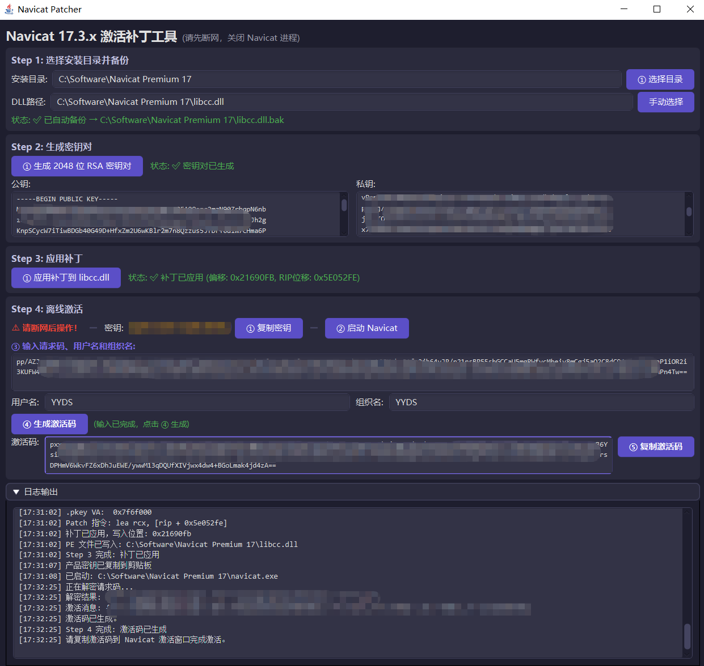

<h1 align="center" style="margin: 30px 0 30px; font-weight: bold;">Navicat 17.3.x Patcher</h1>


> ## ⚠️ 免责声明
>
> 本项目仅供**学习、研究和技术交流**使用，严禁用于任何商业用途或非法用途。
>
> 使用本工具补丁、激活的软件仍需购买正版授权。本项目不对任何因使用本工具而产生的法律责任负责。使用即代表您已阅读并同意本声明。
>
> 如您代表软件版权方且认为本项目侵犯了您的合法权益，请联系本项目所有者删除。




---

## 适用版本

| 项目 | 说明 |
|------|------|
| 软件 | Navicat Premium **17.3.x**（简体中文版） |
| 测试 | Navicat Premium 17.3.11 中文版 ✅ |
| 系统 | Windows x64 |

---

## 环境准备

| 依赖 | 版本要求 | 说明 |
|------|---------|------|
| JDK | 17+ | 推荐Oracle JDK 17+ |
| JavaFX | 17.0.10 | 已在 `pom.xml` 中声明，编译时自动下载 |
| Maven | 3.6+ | 用于编译和打包 |
| Inno Setup | 6.0+ | (可选) 打包 EXE 安装包时需要，[下载地址](https://jrsoftware.org/isdl.php) |

> 从 JDK 11 开始 JavaFX 不再捆绑在 JDK 中，本项目通过 Maven 依赖自动引入，无需单独安装。

### Navicat 下载（Windows平台）

- 官网：			[https://www.navicat.com.cn](https://www.navicat.com.cn)
- 网盘（可选）：        [Navicat 17.3.11 中文版](https://www.alipan.com/s/JxuduumBbSH)

---

## 编译与运行

### 编译	

```bat
mvn compile
```

### 打包（生成 Fat JAR）

```bat
mvn package
```

打包后生成 `target/navicat-patcher-1.0.0.jar`，包含所有依赖。

### 运行

```bat
java -jar target/navicat-patcher-1.0.0.jar
```

> 也可通过 Maven 直接运行（开发阶段）：`mvn javafx:run`

---

## 打包为 EXE 安装包

除 JAR 方式外，还支持一键打包为 Windows EXE 安装包，用户安装后**无需安装 Java**即可直接运行。

### 额外依赖

| 依赖 | 版本要求 | 说明 |
|------|---------|------|
| Inno Setup | 6.0+ | 用于生成 .exe 安装包，[下载地址](https://jrsoftware.org/isdl.php) |

> 安装 Inno Setup 后，请编辑 `build-exe.bat` 顶部的 `INNO_SETUP_DIR` 变量，将其改为您的实际安装路径（例如 `C:\YYJ\Software\Inno Setup 6`）。留空则自动从系统 PATH 中查找。
>
> **注意：** `build-exe.bat` 需要用户配置Maven、JDK、Inno Setup安装路径

### 打包方法

双击项目根目录下的 `build-exe.bat`，或在命令行执行：

```bat
build-exe.bat
```

脚本会自动完成以下步骤：

1. **检查环境** — 验证 JDK、Maven、jpackage、Inno Setup 是否就绪

2. **构建 JAR** — 执行 `mvn clean package` 生成 Fat JAR

3. **生成安装包** — 调用 `jpackage` 生成 EXE 安装包

打包完成后，安装包位于：

```
target/exe-installer/NavicatPatcher-1.0.0.exe
```

> 安装包内置完整 JRE 运行时，体积约 50-80MB。用户双击即可安装，安装后通过开始菜单或桌面快捷方式启动。

---

## 效果预览


---

## 致谢

- [lihaotong0712/navicat-17.3.x-crack](https://github.com/lihaotong0712/navicat-17.3.x-crack)
- [Navicat 17 破解教程 - 吾爱破解](https://www.52pojie.cn/thread-2052969-1-1.html)
